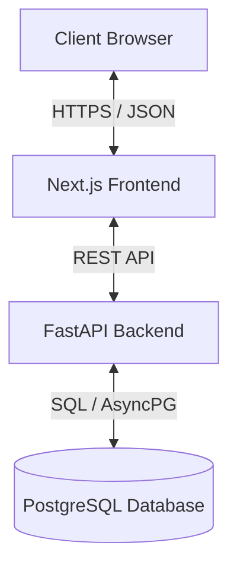

# Opportunity Engine - System Architecture

This document describes the high-level architecture of the Opportunity Engine system.

## Flow Diagram



### Text Flow Representation
```text
Browser
↓
Next.js Frontend
↓
FastAPI Backend
↓
PostgreSQL
```

## Component Breakdown

### 1. Next.js Frontend
- **Port**: `3100`
- **Role**: Renders the user dashboard, search results, and opportunity pipeline configuration. Serves static assets, manages client states, and communicates asynchronously with the FastAPI Backend.

### 2. FastAPI Backend
- **Port**: `8100`
- **Role**: Coordinates business operations. Implements API endpoints for frontend actions, processes crawlers input, interacts with the PostgreSQL database, and coordinates background workers.

### 3. PostgreSQL Database
- **Port**: `5433` (Exposed Host Port)
- **Role**: Relational store for platform data, maintaining application states, qualified opportunities, and credentials.
