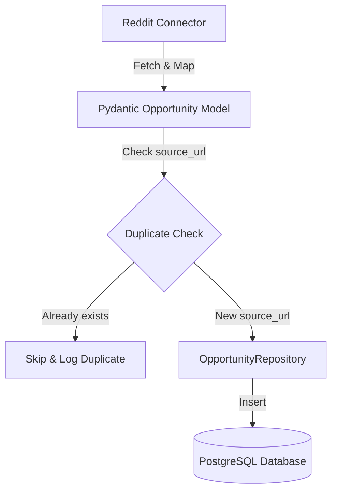

# Database Schema Documentation

This document describes the PostgreSQL database schema for the Opportunity Discovery Platform.

## Tables

### `opportunities`

Stores collected opportunities from various sources (Reddit, YC Jobs, etc.).

| Field Name | Type | Nullable | Description |
| :--- | :--- | :--- | :--- |
| `id` | `UUID` | No | Primary Key. Unique identifier of the opportunity. |
| `title` | `VARCHAR` | No | Title of the opportunity. |
| `description` | `TEXT` | Yes | Detailed description of the opportunity. |
| `source` | `VARCHAR` | No | Source platform where the opportunity was discovered (Indexed). |
| `source_url` | `VARCHAR` | Yes | URL pointing to the original opportunity listing. |
| `company_name` | `VARCHAR` | Yes | Name of the hiring company or client. |
| `location` | `VARCHAR` | Yes | Geographic or remote location of the opportunity. |
| `opportunity_type` | `VARCHAR` | Yes | Type of contract or employment (e.g., Contract, Part-time, Full-time). |
| `posted_at` | `TIMESTAMP WITH TIME ZONE` | Yes | Timestamp when the opportunity was originally posted (Indexed). |
| `collected_at` | `TIMESTAMP WITH TIME ZONE` | No | Timestamp when the opportunity was gathered into the platform. Default: `NOW()`. |
| `status` | `opportunitystatus` (ENUM) | No | Workflow status of the opportunity (Indexed). Default: `NEW`. values: `NEW`, `REVIEWED`, `CONTACTED`, `ARCHIVED`. |
| `created_at` | `TIMESTAMP WITH TIME ZONE` | No | Audit timestamp indicating database row creation time. Default: `NOW()`. |
| `updated_at` | `TIMESTAMP WITH TIME ZONE` | No | Audit timestamp indicating database row last updated time. Default: `NOW()` (automatic on updates). |

### Indexes

The following indexes are defined on the `opportunities` table to optimize query performance:

1. `ix_opportunities_source`: B-tree index on the `source` column. Optimizes filtering/grouping by platform sources.
2. `ix_opportunities_posted_at`: B-tree index on the `posted_at` column. Optimizes time-series sorting and filtering.
3. `ix_opportunities_status`: B-tree index on the `status` column. Optimizes workflow queues filtering.

---

## Schema Migrations (Alembic)

Database schema updates are managed using Alembic. 

### Migration Commands

Make sure to activate your virtual environment and navigate to the `backend` directory first:
```bash
cd backend
source .venv/bin/activate
```

#### Run Migrations
To run all outstanding migrations to the latest revision:
```bash
alembic upgrade head
```

#### Rollback Migration
To revert the last run migration:
```bash
alembic downgrade -1
```

#### Create a New Migration
To auto-generate a new migration script based on SQLAlchemy models changes:
```bash
alembic revision --autogenerate -m "description_of_changes"
```

---

## Ingestion Workflow

The platform ingests opportunities from various source connectors (such as Reddit) using a structured workflow:



### 1. Extraction & Mapping
Source connectors pull opportunities from public APIs or JSON feeds (e.g. `RedditConnector` fetches from subreddits like `r/forhire`). Mapped fields are loaded into Pydantic validation schemas (`app.models.opportunity.Opportunity`) to guarantee structured formats (UUIDs, ISO datetimes).

### 2. Duplicate Prevention
Before persisting, the ingestion script queries PostgreSQL through `OpportunityRepository.find_by_source_url(source_url)`.
- If a record with the same `source_url` already exists, the insert is skipped to prevent duplicate opportunities.
- If no record exists, it proceeds to persistence.

### 3. Database Persistence
New opportunities are mapped to the SQLAlchemy database model and persisted via `OpportunityRepository.create_opportunity()`.

### 4. How to Run Ingestion Script
```bash
# From workspace backend directory
./.venv/bin/python scripts/collect_reddit.py
```
