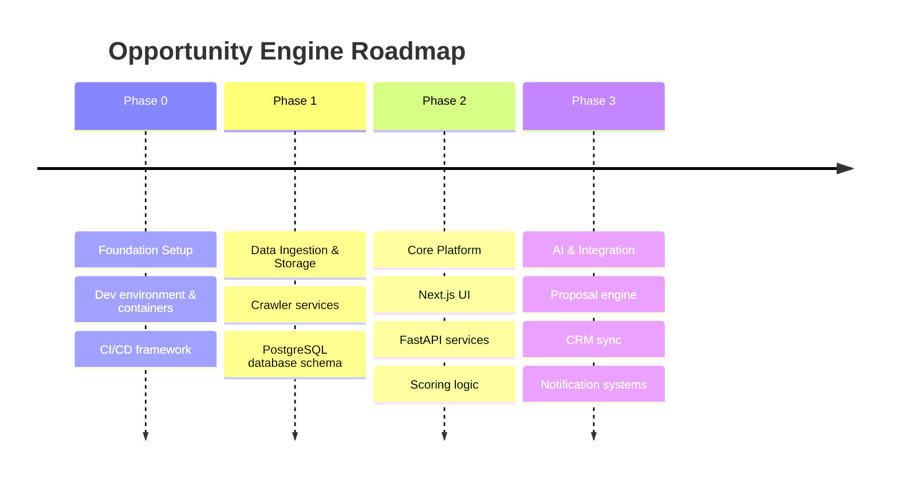

# Opportunity Engine - Product Roadmap

This document outlines the high-level roadmap for the development of the Opportunity Engine.

## Phase 0: Project Foundation (Current)
- Establish codebase structure and monorepo guidelines.
- Dockerize frontend (Next.js), backend (FastAPI), and database (PostgreSQL).
- Configure environment variables and CI/CD pipelines.
- Verify basic end-to-end communication.

## Phase 1: Ingestion & Storage Framework
- Implement target crawler services (web scraping, API connectors).
- Build the core database schema for jobs, opportunities, and organizations.
- Develop simple cron-based ingestion orchestration.

## Phase 2: Core Platform & Pipeline Management
- Build search and discovery dashboard on Next.js.
- Create opportunity feed and manual qualification workflow.
- Implement REST API endpoints for user authentication and state management.
- Develop rule-based qualification rules.

## Phase 3: AI-Assisted Conversion & Integrations
- Integrate LLM-powered lead qualification and classification.
- Implement automated proposal generation and templates.
- Add third-party integrations (CRM, Slack, email triggers).
